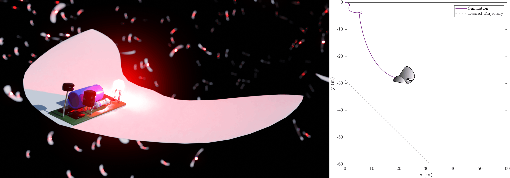
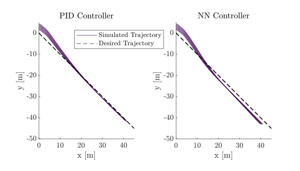

# SAIV_2025_Alsomitra
Codebase for [Neural Network Verification for Gliding Drone Control: A Case Study](https://link.springer.com/chapter/10.1007/978-3-031-99991-8_9)

This folder contains scripts to train and verify a neural network control system for a small bio-inspired gliding drone, actuated by changing the position of the centre of mass (CoM), using behaviour cloning. The drone is based on gliding seeds of _Alsomitra macrocarpa_ and modelled with a quasi-steady 2D aerodynamic model for falling plates with a displaced CoM.

<p align="center">
  
</p>

# Overview
**System requirements**
- MATLAB R2024a - for system simulation and reachability verification (CORA v2025.1.0)
- Python 3.9 - for network training and ONNX manipulation
- Vehicle/Marabou - for network verification

**Repository layout**
- `python_training/` - train regression networks, export ONNX models, and prepare verification data
- `vehicle_verification/` - Vehicle specifications, verification models, IDX data, and outputs
- `matlab_simulation/` - MATLAB simulations used to generate the training data
- `cora_reachability/` - CORA reachability experiments
- `docs/` - paper and slides
- `Figures/` - figure assets for documentation and the paper

# Part 1 - Generating Data in MATLAB

The first step in the full workflow is to run a set of drone simulations in MATLAB in order to generate training data. This code works with MATLAB R2024a - **if the ONNX converter causes issues, I suggest using MATLAB Online**. Start by cloning this repository and adding **all folders and subfolders** to the MATLAB path.

You can run the control simulations with the following command, where the inputs are the controller NN (not used in this case), the plot title, and the NN controller switch (set to `false`, since we are using a PID controller).

```matlab
Alsomitra_Control_Simulation(fullfile("python_training","models","Baseline.onnx"),"PID Controller",false)
```

This generates a plot of simulation traces which should follow the target trajectory, and a dataset in CSV and MAT formats under `matlab_simulation/data/` (`Training_Data.csv` and `Training_Data.mat`).

The training simulations run for 20 seconds with a control frequency of 0.5 s, and since we record the system states and controller output for each control action, this gives 40 data points per trajectory - for a total of 360 data points. Each data point consists of 6 system states, which serve as NN inputs, and a controller output, which our NN will try to predict.

However, for effective adversarial training, this data needs to be normalised between 0 and 1. This is achieved with a min-max normalisation script (`matlab_simulation/Normalise_Data.m`), generating an equivalent normalised dataset (`Training_Data_Normalised.csv` and `Training_Data_Normalised.mat`) in `python_training/data/`. Switching between normalised and system values is a core limitation of this work.

# Part 2 - NN Training in Python

Create a Python 3.9 environment, then install the required packages with:

```bash
pip install -r requirements.txt
```

The Python training workflow is organised as follows:
- `python_training/data/` - normalised training data and test arrays
- `python_training/models/` - exported ONNX models
- `python_training/main.py` - main training entry point
- `python_training/data_handler.py` - loads the CSV data and creates training/test splits
- `python_training/model_builder.py` - defines the regression network architecture
- `python_training/adversarial_trainer.py` - contains both the baseline training loop and the adversarial training loop
- `python_training/evaluator.py` and `python_training/evaluator2.py` - plot and report regression metrics

The training script is `python_training/main.py`, and it generates NNs in `.onnx` format under `python_training/models/`. The baseline model is trained as a regression network on the normalised dataset to predict the controller output from the 6 system states. The adversarial model is trained on perturbed examples generated in an epsilon-ball around the training data, which is the key robust-training step in the paper.

To train a baseline network only, run:

```bash
python python_training/main.py --mode baseline
```

To train an adversarial network with a specific epsilon value, run:

```bash
python python_training/main.py --mode adversarial --epsilon 0.005
```

To train both the baseline and adversarial models together for comparison, run:

```bash
python python_training/main.py --mode both --epsilon 0.005
```

However, the adversarial controllers will not work properly in simulation because they are trained on normalised data. I solve this by adding an extra layer to the network's input and output when it is in ONNX format to **normalise the input and denormalise the output**. The script is called `python_training/normalise_network.py`, and requires 2 things to be implemented:

- The NN to be used (`model_path`) and the output name.
- The normalisation constants `Cs` and `Ss`. These are generated when you normalise the data with `Normalise_Data.m`, so you can copy them from the MATLAB workspace.

`python_training/Export_IDX.py` converts the normalised training data into IDX format for Vehicle-based verification.

# Part 3 - Verification in Vehicle

The relevant files are:
- `vehicle_verification/property_verification/` - global properties and associated models/data
- `vehicle_verification/property_verification_2/` - additional verification experiments
- `vehicle_verification/data/` - shared IDX datasets
- `vehicle_verification/results/` - verification outputs

The Vehicle specifications cover:
- global properties relating the controller output to the desired trajectory
- local robustness properties over epsilon-balls around training data

# Part 4 - Running Inference / Simulations in MATLAB

Once trained, you can import the network back into MATLAB to test regression accuracy and control performance. The NN controller functions as a drop-in replacement for the PID code in the initial simulations, so simulations are run similarly to before:

```matlab
Alsomitra_Control_Simulation(fullfile("cora_reachability","Reachability","base_model_denorm.onnx"),"NN Controller",true)
```

Another script compares the regression performance over the training dataset for multiple networks: `matlab_simulation/Check_NN_Accuracy.m`.

<p align="center">
  
</p>

# Part 5 - Reachability with CORA (MATLAB)

The reachability workflow is kept in `cora_reachability/` as part of the full case-study workflow described in the paper.

# Further Background

The repository also includes:
- `docs/paper/` - manuscript sources and PDF
- `docs/slides/` - presentation slides

If you want the broader context for the case study, start with the paper in `docs/paper/`.
